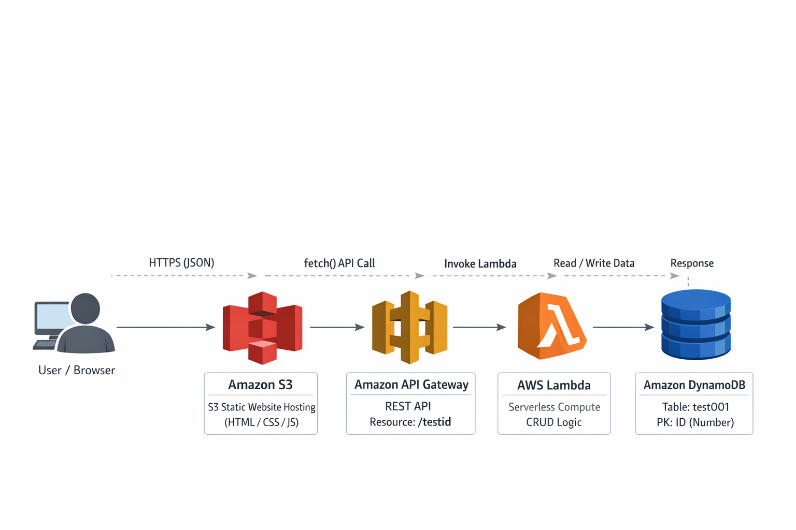

# AWS Serverless Web Application

A simple **serverless web application** built on AWS using **Amazon S3, API Gateway, AWS Lambda, and DynamoDB**.  
The project demonstrates an end-to-end **frontend → backend → database** flow without managing any servers.

---

## 🏗️ Architecture

Browser -> S3 Static Website -> API Gateway (REST API) -> AWS Lambda -> Amazon DynamoDB

---

## 📌 Overview

- Frontend hosted as a **static website on Amazon S3**
- Backend APIs exposed using **Amazon API Gateway**
- Business logic implemented using **AWS Lambda**
- Data stored and retrieved from **Amazon DynamoDB**
- Communication happens over **HTTPS using JSON**
- Fully **serverless and auto-scaling**

---

## 🧰 Technology Stack

- Amazon S3 – Static Website Hosting
- Amazon API Gateway – REST API
- AWS Lambda – Serverless Compute
- Amazon DynamoDB – NoSQL Database
- JavaScript – Frontend API calls
- AWS SDK – DynamoDB operations

---

## 🔁 Application Flow

1. User interacts with the S3-hosted website
2. JavaScript sends an HTTPS request to API Gateway
3. API Gateway invokes the Lambda function
4. Lambda performs CRUD operations on DynamoDB
5. Response is returned back to the frontend

---

## 📊 DynamoDB Table

- **Table Name:** `test001`
- **Partition Key:** `ID` (Number)
- Stores structured and nested JSON data

---

## 🚀 Features

- Fully serverless architecture
- No EC2 instances or load balancers
- Automatic scaling and high availability
- Clean separation of frontend and backend
- Supports Create, Read, Update, Delete operations

---

## 📸 Screenshots

Screenshots related to:
- API Gateway configuration
- Lambda execution
- DynamoDB items
- S3 website output  

are available in the `screenshots/` directory.

---

## 🔮 Future Enhancements

- Add authentication using Amazon Cognito
- Use CloudFront for CDN and HTTPS
- Add input validation and error handling
- Add monitoring and alerts using CloudWatch
- Infrastructure as Code using Terraform or CloudFormation

---

## 👤 Author

**Naga Ajay Ragyari**  
Platform / DevOps Engineer  
AWS | Serverless | Cloud

